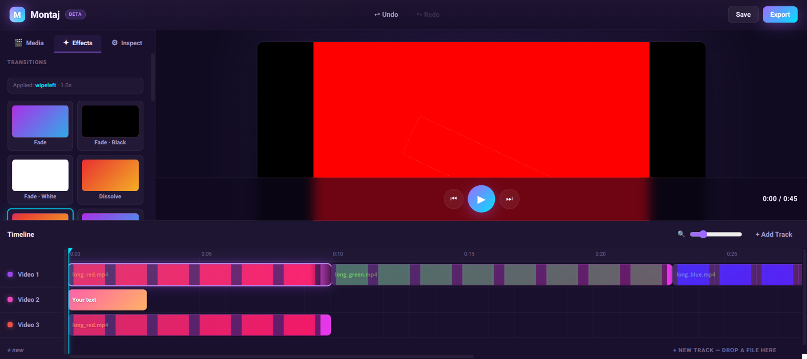

<h1 align="center">Montaj</h1>

<p align="center">
  A fully client-side, browser-based video editor — timeline, transforms,
  effects, transitions, and audio mixing, with FFmpeg.wasm export.
  <br/>
  <em>No server. No uploads. Your media never leaves the tab.</em>
</p>

<p align="center">
  
  
  
  
  
</p>

---

## What is Montaj?

Montaj is a video editor that runs entirely in your browser. You drop a video
in, cut it on a timeline, layer text, apply transitions and color grades,
and export an MP4 — all without a backend. Source files live in IndexedDB,
the timeline state in `localStorage`, and the export is rendered by
FFmpeg.wasm in a Web Worker.

The editor follows one operating contract: **preview is an approximation,
export is the truth.** The live canvas renders a fast Canvas2D approximation
of every effect; the export filtergraph applies the real FFmpeg filter. The
two paths are wired together so adding a feature means implementing it twice
— once for live feedback, once for fidelity.

## Highlights

| Capability | What it does |
|---|---|
| **Timeline editing** | Multi-track, drag-to-move, trim handles, snap-to-edges, split at playhead, undo/redo. |
| **Free transforms** | Per-clip `{ x, y, scale, rotation }` with drag-and-resize handles on the canvas, for text and video. |
| **Picture-in-picture** | `contain` / `cover` / `free` fit modes per video clip. Drag a small video into a corner of a larger one. |
| **Color filters** | Brightness, contrast, saturation, hue per clip. Live preview via `ctx.filter`; export via FFmpeg `eq` + `hue`. |
| **16 transitions** | Fade, fade-black, fade-white, dissolve, four wipes, four slides, circle open/close, pixelize, radial. Click-to-apply from the FX browser. |
| **Audio** | Per-clip volume, mute, pan (linear stereo balance), and step-function ducking under a source clip. |
| **Text overlays** | Free X/Y, scale, rotation, color, size. Stroke + fill for legibility against any background. |
| **Persistence** | Project state in `localStorage`, media files in IndexedDB. Reload-survives. |
| **MP4 export** | FFmpeg.wasm in a Web Worker. Fragmented MP4 so it streams to the download link without seek-back. Three quality presets. |

## Screenshot



## Architecture

```
src/
├── components/
│   ├── TopBar/             — logo, undo/redo, save, export
│   ├── Sidebar/            — Media | Effects | Inspect tabs
│   │   ├── Sidebar.tsx
│   │   └── EffectsPanel.tsx
│   ├── Preview/
│   │   ├── PreviewPanel.tsx — Canvas2D live preview
│   │   └── CanvasOverlay.tsx — drag handles over the canvas
│   ├── Timeline/TimelinePanel.tsx — tracks, ruler, clips, snap
│   ├── Inspector/Inspector.tsx — per-clip property panels
│   └── Export/ExportDialog.tsx
├── state/
│   ├── reducer.ts          — useReducer with clamping and guards
│   ├── actions.ts          — typed action union
│   ├── history.ts          — undo/redo wrapper, 50-slot ring
│   └── persistence.ts      — v2 → v3 forward migration
├── services/
│   ├── exportEngine.ts     — Worker bridge with progress events
│   ├── filterGraph.ts      — ProjectState → FFmpeg filter_complex
│   ├── mediaStore.ts       — IndexedDB media persistence
│   ├── scrubber.ts
│   └── thumbnails.ts
├── workers/
│   └── ffmpeg.worker.ts    — Web Worker, FFmpeg.wasm bootstrap, font load
├── types/project.ts
└── styles/globals.css
```

### Key technical choices

- **Two render paths in lockstep.** `PreviewPanel.tsx` (Canvas2D) and
  `filterGraph.ts` (FFmpeg) implement the same effect twice. Anything you
  see on the canvas has a matching filter in the export graph.
- **`xfade` cascade for transitions.** Adjacent transition-linked clips are
  collapsed into a "run" and rendered through a chain of `xfade` (video) +
  `acrossfade` (audio) nodes. Free-fit clips are excluded from runs since
  their layer dimensions don't match the canvas.
- **One transform model.** `Transform { x, y, scale, rotation }` with
  normalized 0–1 coordinates applies uniformly to text and video clips —
  used by both the drag overlay and the export graph.
- **Local-state-during-gesture commit-on-pointerup.** Pointer drags update a
  `pendingTransform` in component state and dispatch `SET_CLIP_TRANSFORM`
  once at the end, so a long drag doesn't fill the 50-slot history ring.
- **Fragmented MP4 muxer.** FFmpeg.wasm's virtual FS is unreliable at the
  seek-back the default MP4 muxer uses, leaving "mdat size=0, no moov"
  outputs at any meaningful size. Export uses
  `-movflags frag_keyframe+empty_moov+default_base_moof` for stream-friendly
  output that plays anywhere without finalization.

## Getting started

### Prerequisites

- Node.js **18+**
- A browser with `SharedArrayBuffer` support and cross-origin isolation
  (Chrome, Edge, Firefox, recent Safari). The dev server already sets the
  `Cross-Origin-Opener-Policy: same-origin` and
  `Cross-Origin-Embedder-Policy: require-corp` headers required for the
  multi-threaded WASM build.

### Install and run

```bash
cd frontend
npm install
npm run dev
```

Open <http://localhost:3000>. Drop a video into the left sidebar and start
editing.

### Build for production

```bash
npm run build      # tsc -b && vite build → frontend/dist
npm run preview    # serve the built bundle with COOP/COEP headers
```

The `postinstall` script copies `@ffmpeg/core` (the WASM + glue JS) into
`public/ffmpeg/` so the worker can load it as a same-origin blob URL.

### Lint and type-check

```bash
npm run lint
npx tsc -b
```

## Keyboard shortcuts

| Key | Action |
|---|---|
| `Space` | Play / pause |
| `Ctrl + Z` | Undo |
| `Ctrl + Shift + Z` | Redo |
| `Delete` / `Backspace` | Delete selected clip |
| `S` | Split selected clip at playhead |
| `Shift` (while dragging) | Snap to canvas thirds / center |

## How the export works

1. UI dispatches actions to a `useReducer` store backed by a history ring.
   Persistent fields autosave to `localStorage` after a 750 ms debounce.
2. Media files are saved to IndexedDB via `idb-keyval` on import, then
   hydrated back into `File` + `objectURL` on next mount.
3. When the user clicks **Export**, `useExport` builds an `ExportTrack[]`
   from the current state and posts it to the FFmpeg worker.
4. The worker writes media files into FFmpeg's virtual FS, fetches the font
   for `drawtext`, runs `buildExportCommand` to produce a `filter_complex`
   plus `-map [outv] -map [outa]`, executes FFmpeg, reads `output.mp4`,
   and transfers the buffer back to the main thread.
5. The main thread wraps the buffer as a `Blob` and creates an
   `URL.createObjectURL` → presented as a download link.

Progress is reported by parsing `time=HH:MM:SS.SS` lines from FFmpeg's stderr
log inside the worker.

## Browser memory and performance

- FFmpeg.wasm is the same FFmpeg, compiled to WebAssembly. It is ~2–3×
  slower than native FFmpeg and single-threaded by default unless the page
  is cross-origin isolated.
- The WASM heap caps at ~2–4 GB. Input files are kept in the heap during
  export, so a multi-gigabyte project may OOM. `useExport` does a
  per-browser size check (~0.8 GB Safari, ~1.5 GB elsewhere) and warns
  before attempting.
- Text rotation renders a transparent canvas-sized `yuva420p` layer per
  rotated text clip, then composites via `rotate + overlay`. Cheap for a
  handful of clips; scales linearly. Avoid stacking many rotated text clips
  over long timelines.

## Roadmap

- [ ] Smoother ducking via `sidechaincompress` (currently a step function)
- [ ] Per-clip Web Audio routing so pan / duck are audible during preview
- [ ] Keyframed animation (transform over time, not just static)
- [ ] Export presets for vertical (9:16) / square (1:1)
- [ ] Drag-and-drop reorder of tracks
- [ ] Multi-clip selection + group operations

## License

MIT.
